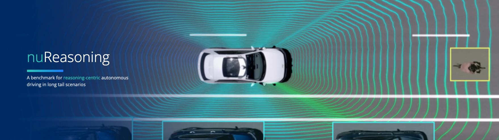

<div align="center">

# nuReasoning

**A reasoning-centric multimodal benchmark for end-to-end autonomous driving in long-tail scenarios.**

A joint development of Motional™ and UCLA.

<p align="center">
  
  &nbsp;&nbsp;&nbsp;&nbsp;
  
</p>

______________________________________________________________________

<p align="center">
  <a href="https://nureasoning.github.io/">Website</a> •
  <a href="https://huggingface.co/datasets/nureasoning/nuReasoning">Download</a> •
  <a href="#citation">Citation</a><br>
  <a href="#changelog">Changelog</a> •
  <a href="#devkit-structure">Structure</a> •
  <a href="docs/installation.md">Setup</a><br>
  <a href="tutorials/nureasoning_data_visualization.ipynb">Tutorial</a> •
  <a href="https://huggingface.co/spaces/nureasoning/nureasoning-challenge-2026">Competition</a>
</p>

[]()
[](./LICENSE.txt)
[](https://arxiv.org/abs/2605.31572)
[](https://huggingface.co/datasets/nureasoning/nuReasoning)

______________________________________________________________________

<br>

<p align="center"></p>

</div>

______________________________________________________________________

## Dataset Release

#### Please check the [Dataset Setup](docs/dataset_setup.md) page for the file structure and download instructions.

- **nuReasoning** contains 20K curated 20-second driving clips (105 hours) at 10 Hz, with synchronized 8-camera images, LiDAR, HD maps, ego states, object annotations, traffic-light states, route commands, and frame-level **Spatial**, **Decision**, and **Counterfactual** reasoning annotations.
- Splits: **17K train**, **2K validation**, and **1K private test** clips. Test clips ship **without** ground truth (no reasoning annotations or future states) and are evaluated via [submission](docs/submission.md).

______________________________________________________________________

## Challenge

#### IMPORTANT: The private test set is scored as a combined **planning & reasoning** challenge. Submissions are a single JSON file. Validate locally before upload.

- Released inference clips contain cameras, ego state through the key frame, and questions to answer. The official file is **one JSON object with one entry per clip**; each entry holds that clip's planned trajectory **and** its question answers.
- **Planning Score**: mean nuReasoning planning score (NPS) across all scenarios.
- **Reasoning Score**: overall multiple-choice accuracy across all questions.
- **Final Score** = 75% Planning Score + 25% Reasoning Score.
- Upload to the [nuReasoning Challenge 2026](https://huggingface.co/spaces/nureasoning/nureasoning-challenge-2026). See the [submission tutorial](docs/submission.md) and [`tutorials/nureasoning_challenge_submission.ipynb`](tutorials/nureasoning_challenge_submission.ipynb).

______________________________________________________________________

## Changelog

- **Sep 2026**
  - v0.1 Devkit: Initial nuReasoning devkit release — dataset download and visualization, nuVLA training/validation, planning benchmark, challenge submission (planning + reasoning), VQA generation, reasoning-only fine-tuning and evaluation, and baseline planner interfaces.

______________________________________________________________________

## Devkit and dataset setup

Please refer to the [installation page](docs/installation.md) for detailed instructions on how to setup the devkit.

Please refer to the [dataset page](docs/dataset_setup.md) for detailed instructions on how to download and setup the dataset. In short:

```bash
conda env create -f environment.yml
conda activate nureasoning
pip install -e .
hf auth login
python -m nureasoning.dataset.download --local-dir ./dataset
```

______________________________________________________________________

## Getting started

Please follow these steps to make yourself familiar with the nuReasoning dataset:

- Familiarize yourself with the dataset structure and the reasoning annotation schema on the [dataset page](https://huggingface.co/datasets/nureasoning/nuReasoning).
- Setup the devkit and dataset as described above.
- Visualize the sensor data and reasoning annotations:

```bash
# Composite 8-camera + ego-state + BEV (+ LiDAR) overview PNG
python -m nureasoning.visualization.view_data \
  --input-root ./dataset/data/train/part_1 --frame-index 100

# Same layout as an MP4
python -m nureasoning.visualization.view_data \
  --input-root ./dataset/data/train/part_1 --video --max-frames 50

# Driving / Counterfactual text above left/front/right cameras at the key frame
python -m nureasoning.visualization.view_reasoning \
  --input-root ./dataset/data/train/part_1 \
  --max-clips 1 --frame-index 100 --save-figures
```

A walkthrough notebook is in [`tutorials/nureasoning_data_visualization.ipynb`](tutorials/nureasoning_data_visualization.ipynb).

______________________________________________________________________

## VLA training and evaluation

Train the **nuVLA** vision-language-action model (VLM backbone + flow-matching action expert) on **all** training parts, with validation on **all** validation parts. Hugging Face weights are stored under `./models/.hf` (or `HF_HOME`). Pass a snapshot directory with `--vlm_model_path` if you already downloaded the model. See the [nuVLA page](docs/nuvla.md) for architecture, dataloader, and checkpoint layout.

```bash
# Single GPU
python -m nureasoning.nuvla.train \
  --data_root ./dataset/data/train \
  --test_data_root ./dataset/data/validation \
  --output_dir ./nureasoning_vla_workspace

# Multi-GPU (DDP)
torchrun --nproc_per_node=8 -m nureasoning.nuvla.train \
  --data_root ./dataset/data/train \
  --test_data_root ./dataset/data/validation \
  --output_dir ./nureasoning_vla_workspace
```

Validate the trained model (reasoning generation and open-loop trajectory metrics ADE/FDE/heading):

```bash
python -m nureasoning.nuvla.evaluate \
  --checkpoint_dir ./nureasoning_vla_workspace/final \
  --test_data_root ./dataset/data/validation \
  --mode both --visualize
```

Run the **planning benchmark** on validation parts (ground truth available). It scores collision, driveable area, progress, comfort, and human likeness per clip. `--key_frame_index` defaults to 100 (≈ 10 s at 10 Hz):

```bash
python -m nureasoning.planning.benchmark \
  --data_root ./dataset/data/validation \
  --checkpoint_dir ./nureasoning_vla_workspace/final \
  --key_frame_index 100
```

Baseline planner interfaces (constant velocity, plus UniAD / DiffusionDrive) live under [`nureasoning/planning/baselines`](nureasoning/planning/baselines/README.md). A planning walkthrough is in [`tutorials/nureasoning_planning_tutorial.ipynb`](tutorials/nureasoning_planning_tutorial.ipynb).

______________________________________________________________________

## Reasoning training and evaluation

For models that learn from structured reasoning / VQA supervision without the planning action expert, first materialize question–answer pairs from the reasoning annotations:

```bash
python -m nureasoning.vqa.generate \
  --data-root ./dataset/data/train --output ./vqa_output_train
python -m nureasoning.vqa.generate \
  --data-root ./dataset/data/validation --output ./vqa_output_val
```

The generated VQA files contain multiple-choice, numerical, and free-text questions grounded in the Spatial, Decision, and Counterfactual annotations. `nureasoning.reasoning` takes it from there — LoRA fine-tuning of a vision-language backbone on those questions, and scoring of its answers.

Every example is **multi-view multi-frame**: 8 cameras × 2 frames (current plus 1 s earlier). Each image is preceded by the same caption nuVLA training uses (`t=-1, left camera.` / `t=0 (current), front camera.`). `--history-first` puts all cameras at t−1 s first, then all cameras at t=0. The user text is the question, `A)` / `B)` choices, and an answer-format instruction — not the nuVLA “You are evaluating a driving scene…” wrapper. Image order, captions, and that prompt **must match** between `build_sft`, `evaluate`, and challenge `--reasoning-provider api`. See the [reasoning page](docs/reasoning.md) for the layout and a full prompt example.

```bash
# 1) VQA files -> supervised fine-tuning JSONL
python -m nureasoning.reasoning.build_sft \
  --vqa-dir ./vqa_output_train \
  --output ./reasoning_workspace/sft_train_multiframe.jsonl \
  --keyframe-only --num-forward-frames 2 --max-images 16 --history-first \
  --max-spatial-per-frame 10

# 2) LoRA SFT
torchrun --nproc_per_node=8 -m nureasoning.reasoning.train \
  --config nureasoning/reasoning/configs/qwen3.5-4b-multiframe.yaml

# 3) Merge the adapter into the base weights for serving.
# Replace <run-stamp> with the _YYYY-MM-DD_HHMMSS directory printed at train time.
python -m nureasoning.reasoning.merge_lora \
  --base Qwen/Qwen3.5-4B \
  --adapter ./reasoning_workspace/lora_qwen3.5-4b-multiframe_<run-stamp> \
  --out ./reasoning_workspace/merged_qwen3.5-4b-multiframe
```

Training, merge, and scoring all stay in `nureasoning`. Serving is a second process: open another terminal, activate a **dedicated** `vllm` **env**, and leave it running. Do not `pip install vllm` into `nureasoning` — it overwrites the training PyTorch stack. Setup is in [installation](docs/installation.md#reasoning-training--testing).

```bash
# Terminal 2 — vLLM env. Blocks until you stop it; leave this running.
conda activate vllm
VLLM_USE_FLASHINFER_SAMPLER=0 vllm serve ./reasoning_workspace/merged_qwen3.5-4b-multiframe \
  --served-model-name nureasoning-4b-sft \
  --max-model-len 24576 \
  --dtype bfloat16 \
  --mm-processor-kwargs '{"max_pixels": 200704}' \
  --enable-prefix-caching
```

```bash
# Terminal 1 — still nureasoning. evaluate POSTs questions to the server above;
# it does not load the checkpoint and does not need the vllm env.
python -m nureasoning.reasoning.evaluate \
  --vqa-dir ./vqa_output_val --model nureasoning-4b-sft \
  --output-root ./reasoning_eval \
  --keyframe-only --num-forward-frames 2 --max-images 16 --history-first \
  --max-spatial-per-frame 10
```

The backbone class is read from the checkpoint config, so Qwen3.5, Qwen3-VL and other image-text-to-text models all run through the same commands; evaluating an unmodified base model or a hosted API only means pointing `evaluate` at a different endpoint. See the [reasoning page](docs/reasoning.md) for image layout, captions, the training prompt, metric definitions, and output layout. For challenge evaluation of reasoning answers, see [challenge submission](docs/submission.md). A reasoning walkthrough is in [`tutorials/nureasoning_reasoning_tutorial.ipynb`](tutorials/nureasoning_reasoning_tutorial.ipynb).

______________________________________________________________________

## Challenge submission

The private test set is scored as a combined **planning + reasoning** challenge. Released inference clips contain cameras, ego state through the key frame, and questions to answer. The official file is **one JSON object with one entry per clip**; each entry holds that clip's planned trajectory **and** its question answers. See the [submission tutorial](docs/submission.md) and [`tutorials/nureasoning_challenge_submission.ipynb`](tutorials/nureasoning_challenge_submission.ipynb).

```
dataset/data/test/
└── <clip_name>/
    ├── metadata.json
    ├── cameras/CAM_M_*/...
    ├── ego_state/*.pkl
    └── reasoning_questions.json   # one file per clip; no answers
```

```bash
# Dry-run (constant-velocity + stub answers)
python -m nureasoning.submission.challenge \
  --data-root ./dataset/data/test \
  --provider split \
  --planning-provider constant_velocity \
  --reasoning-provider stub \
  --output challenge_submission.json

# One-model path: nuVLA trained with QA (planning + answers from one checkpoint)
python -m nureasoning.submission.challenge \
  --data-root ./dataset/data/test \
  --provider nuvla \
  --checkpoint-dir ./nureasoning_vla_qa_workspace/final \
  --output challenge_submission.json

# Split path: nuVLA planning + a separately trained reasoning model (HTTP API)
python -m nureasoning.submission.challenge \
  --data-root ./dataset/data/test \
  --provider split \
  --planning-provider vla --checkpoint-dir ./nureasoning_vla_workspace/final \
  --reasoning-provider api --api-model nureasoning-4b-sft \
  --output challenge_submission.json
```

`--api-model` is the `--served-model-name` of the running server (`nureasoning-4b-sft` in the vLLM command above). Hosted Hugging Face evaluation reads this submission file. Validate the file before upload with `python -m nureasoning.submission.challenge --validate-only challenge_submission.json`.

______________________________________________________________________

## Devkit structure

Our code is organized in these directories:

```
nureasoning-devkit
├── docs                          - Documentation for install, dataset, nuVLA, reasoning, and submission.
├── nureasoning                   - The main Python package.
│   ├── common                    - Shared schemas (clips, frames, maps, ego, annotations).
│   ├── dataset                   - Dataset download (Hugging Face) and clip extraction.
│   ├── visualization             - Sensor-data and reasoning-annotation viewers / plotting.
│   ├── nuvla                     - nuVLA training, evaluation, and trajectory provider.
│   │   └── models                - VLM backbone, flow-matching action expert, dataloader.
│   ├── planning                  - Planning benchmark, result visualization.
│   │   └── baselines             - Constant velocity (implemented); UniAD /
│   │                               DiffusionDrive (placeholders).
│   ├── reasoning                 - Reasoning-only LoRA fine-tuning, adapter merging,
│   │   │                           and question-answering evaluation.
│   │   ├── configs               - Training configs per backbone.
│   │   └── modules               - Image selection, prompts, metrics, inference client.
│   ├── submission                - Challenge submission JSON (per-clip trajectories + answers).
│   └── vqa                       - VQA generation from structured reasoning annotations.
├── tutorials                     - Getting-started notebooks.
├── environment.yml               - Conda environment (Python 3.10, CUDA 12.8 PyTorch stack).
└── requirements.txt              - Loose pip requirements.
```

Entry points are run as modules from the repository root (after `pip install -e .`):

| Task                               | Command                                              |
| ---------------------------------- | ---------------------------------------------------- |
| Download data                      | `python -m nureasoning.dataset.download`             |
| View sensors                       | `python -m nureasoning.visualization.view_data`      |
| View reasoning                     | `python -m nureasoning.visualization.view_reasoning` |
| Train nuVLA                        | `python -m nureasoning.nuvla.train`                  |
| Evaluate nuVLA                     | `python -m nureasoning.nuvla.evaluate`               |
| Planning benchmark                 | `python -m nureasoning.planning.benchmark`           |
| Visualize planning results         | `python -m nureasoning.planning.visualize`           |
| Challenge submission               | `python -m nureasoning.submission.challenge`         |
| Generate VQA                       | `python -m nureasoning.vqa.generate`                 |
| Build reasoning SFT data           | `python -m nureasoning.reasoning.build_sft`          |
| Build reasoning manifest           | `python -m nureasoning.reasoning.build_manifest`     |
| Fine-tune on reasoning             | `python -m nureasoning.reasoning.train`              |
| Merge LoRA adapter                 | `python -m nureasoning.reasoning.merge_lora`         |
| Evaluate reasoning                 | `python -m nureasoning.reasoning.evaluate`           |
| Reaggregate reasoning metrics      | `python -m nureasoning.reasoning.reaggregate`        |

For a quick installation check that does not download data or models:

```bash
python -m nureasoning.reasoning.modules.selftest_metrics
```

______________________________________________________________________

## Citation

Please use the following citation when referencing nuReasoning:

```bibtex
@article{huang2026nureasoning,
  title   = {nuReasoning: A Reasoning-Centric Dataset and Benchmark for Long-Tail Autonomous Driving},
  author  = {Huang, Zhiyu and Liu, Johnson and Song, Rui and Zhou, Zewei and Yang, Ruining and Zhang, Yun and Cai, Tianhui and Zhang, Hanyin and Gao, Mingxuan and Xu, Valeria and Chen, Jiali and Shen, Yishan and Guo, Yiluan and Qi, Tony Xuewei and Ma, Jiaqi},
  journal = {arXiv preprint arXiv:2605.31572},
  year    = {2026},
  url     = {https://arxiv.org/abs/2605.31572}
}
```

______________________________________________________________________

## License

nuReasoning has separate terms for non-commercial and commercial use; see the license files on the [dataset page](https://huggingface.co/datasets/nureasoning/nuReasoning). Commercial use requires a commercial license; contact [nuScenes@motional.com](mailto:nuScenes@motional.com).
